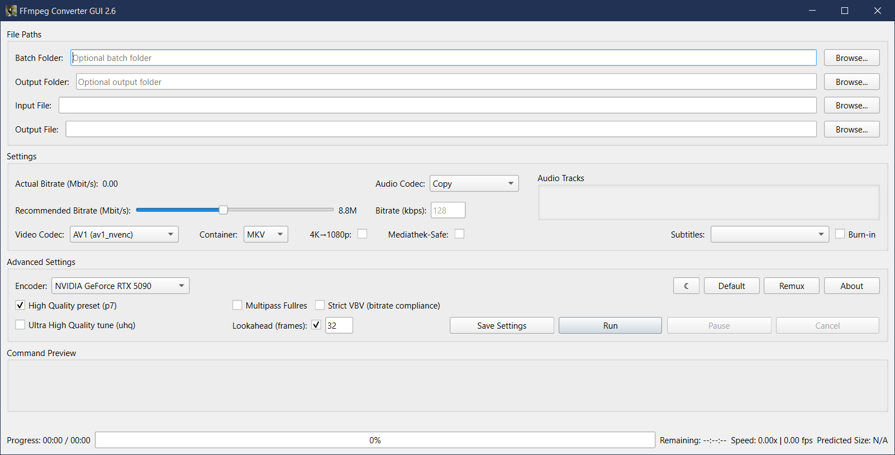
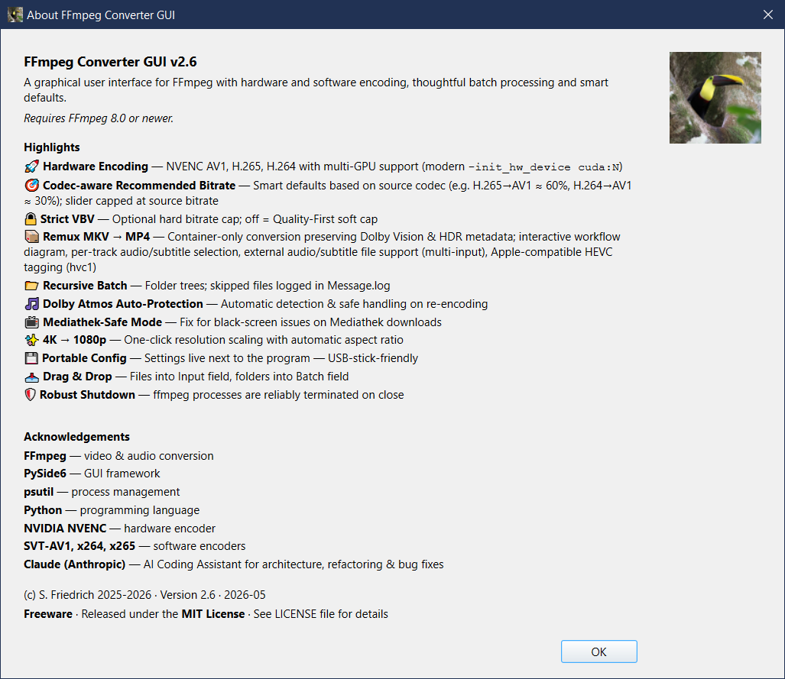

# FFmpeg Converter GUI

> A powerful graphical user interface for FFmpeg — hardware-accelerated encoding, smart batch processing, and Dolby Atmos protection. All in one window.



---

## ✨ Features

### 🚀 Hardware Encoding (NVIDIA NVENC)
- **AV1, H.265, H.264** via NVENC with modern `‑init_hw_device cuda:N` syntax (FFmpeg 8.0+)
- **Multi-GPU support** — all available GPUs are detected and selectable from a dropdown
- Automatic fallback to software encoding (SVT-AV1, x265, x264)

### 🎯 Codec-aware Smart Bitrate
No more one-size-fits-all 50% default. The recommended bitrate is calculated from source codec, target codec **and** resolution:

| Source → Target | H.264 | H.265 | AV1  |
|-----------------|-------|-------|------|
| **H.264**       | 0.50× | 0.35× | 0.30× |
| **H.265**       | 1.00× | 0.70× | 0.60× |
| **AV1**         | 2.00× | 1.20× | 0.80× |

Quality floors ensure a minimum bitrate per resolution and codec (e.g. AV1 @ 1080p ≥ 2.0 Mbps). The slider is capped at the source bitrate — re-encoding above source quality makes no sense.

### 📦 Remux MKV → MP4 (No Re-Encoding)
A dedicated dialog for pure container conversion:
- **Zero quality loss** — video stream is copied 1:1
- **Dolby Vision & HDR metadata preserved** 100%
- Per-track audio and subtitle selection with All/None helper
- External audio/subtitle files can be added as extra inputs
- Apple compatibility toggle (`hvc1` tag for QuickTime/Apple TV)
- Live workflow diagram that adapts to the loaded streams

### 🎵 Dolby Atmos Auto-Protection
Atmos tracks are automatically detected and handled safely during re-encoding — no accidental downmix.

### 📂 Recursive Batch Processing
- Point at a folder and encode entire directory trees
- Skipped files (unsupported format, errors) are logged to `Message.log`
- Toast notification on completion with file count

### 🌙 Dark Mode
Live switch between light and dark theme — no restart needed. The preference is saved to `Converter_settings.json`.

### 📺 Mediathek-Safe Mode
Fixes black-screen playback issues common with ARD/ZDF Mediathek downloads by regenerating timestamps and enforcing a constant frame rate.

### ✨ 4K → 1080p Downscaling
One-click resolution scaling with automatic aspect ratio preservation (Lanczos filter).

### 💾 Portable Configuration
Settings live **next to the executable** — copy the folder to a USB stick and everything works.

### 📥 Drag & Drop
- Drag a **file** onto the window → sets the Input field  
- Drag a **folder** onto the window → sets the Batch folder

### 🔍 Live Command Preview
The full FFmpeg command is shown in real time as you change settings — no surprises.

---

## 📸 Screenshots

| Main Window | About |
|:-----------:|:-----:|
|  |  |

---

## 🛠️ Requirements

| Dependency | Version | Notes |
|------------|---------|-------|
| **FFmpeg** | ≥ 8.0 | Must be in system `PATH` or next to the EXE. [Download](https://ffmpeg.org/download.html) |
| **ffprobe** | ≥ 8.0 | Ships with FFmpeg |
| **Python** | ≥ 3.10 | Only needed if running from source |
| **PySide6** | ≥ 6.5 | LGPL — installed via pip |
| **psutil** | ≥ 5.9 | Process management |

> **Note:** FFmpeg 8.0+ is required. Older versions (6.x/7.x) will not work due to the `-init_hw_device` syntax.

---

## 🚀 Getting Started

### Option A — Standalone EXE (Windows, recommended)
1. Download `ffmpeg_converter_gui_v30.exe`
2. Place it in a folder of your choice
3. Download [FFmpeg 8.0+](https://ffmpeg.org/download.html) and either:
   - Add it to your system `PATH`, **or**
   - Copy `ffmpeg.exe` and `ffprobe.exe` next to the EXE
4. Double-click the EXE — done.

### Option B — Run from Source
```bash
# Clone the repository
git clone https://github.com/your-username/ffmpeg-converter-gui.git
cd ffmpeg-converter-gui

# Install Python dependencies
pip install -r Requirements.txt

# Run
python ffmpeg_converter_gui__v30.py
```

### Option C — Build EXE yourself
See [NUITKA_BUILD_GUIDE.md](NUITKA_BUILD_GUIDE.md) for full build instructions.

```bat
# Quick build (folder distribution)
build_nuitka.bat

# Single-file EXE (slower startup, easier distribution)
build_nuitka_onefile.bat
```

---

## 🎬 Supported Formats

### Video Codecs
| Codec | NVENC (GPU) | Software |
|-------|:-----------:|:--------:|
| AV1   | ✅ av1_nvenc | ✅ SVT-AV1 |
| H.265 | ✅ hevc_nvenc | ✅ x265 |
| H.264 | ✅ h264_nvenc | ✅ x264 |
| VP9   | ❌ | ✅ libvpx-vp9 |

### Audio Codecs
AAC · AC-3 · E-AC-3 · MP3 · Opus · FLAC · Vorbis · Stream Copy

### Container Formats

| Container | Video Codecs | Audio Codecs |
|-----------|-------------|--------------|
| **MKV** | AV1, H.265, H.264, VP9 | Copy, AAC, AC-3, E-AC-3, MP3, Opus, FLAC |
| **MP4** | AV1, H.265, H.264 | Copy, AAC, AC-3, E-AC-3, MP3, Opus, FLAC |
| **MOV** | H.265, H.264 | Copy, AAC, AC-3, MP3 |
| **WebM** | AV1, VP9 | Opus, Vorbis |

---

## 📁 Project Structure

```
ffmpeg-converter-gui/
├── ffmpeg_converter_gui__v30.py   # Main application
├── Requirements.txt               # Python dependencies
├── build_nuitka.bat               # Build script (folder EXE)
├── build_nuitka_onefile.bat       # Build script (single EXE)
├── Converter_settings.json        # Auto-created on first run
├── screenshoot.png                # Main window screenshot
├── screenshoot_about.png          # About dialog screenshot
├── Changelog.md                   # Full version history
├── Dolby_Atmos_Feature_Documentation.md
├── Atmos_Quick_Start.md
├── Remux_Documentation.md
└── NUITKA_BUILD_GUIDE.md
```

---

## 📚 Documentation

| Document | Description |
|----------|-------------|
| [Changelog.md](Changelog.md) | Full version history with all changes |
| [Dolby_Atmos_Feature_Documentation.md](Dolby_Atmos_Feature_Documentation.md) | Technical details on Atmos handling |
| [Atmos_Quick_Start.md](Atmos_Quick_Start.md) | User-friendly Atmos guide |
| [Remux_Documentation.md](Remux_Documentation.md) | MKV → MP4 remux workflow |
| [NUITKA_BUILD_GUIDE.md](NUITKA_BUILD_GUIDE.md) | How to compile a standalone EXE |

---

## 📝 Changelog

See [Changelog.md](Changelog.md) for the full history. Recent highlights:

**v3.0** *(current)*
- Latest release

**v2.6** — PySide6 Migration & Dark Mode  
**v2.5** — FFmpeg 8.0 modernization, Remux Dialog, Codec-aware Bitrate, Multi-GPU  
**v2.0** — Audio track defaults & stability  
**v1.5.x** — Mediathek-Safe Mode, Robust Shutdown, Batch fixes  

---

## ⚙️ Verifying the EXE (SHA-256)

```powershell
Get-FileHash ffmpeg_converter_gui_v30.exe -Algorithm SHA256
```

Compare the output against `ffmpeg_converter_gui_v30.sha256`.

---

## 📄 License

**Freeware** — Free for personal and commercial use.

| Component | License |
|-----------|---------|
| FFmpeg | GPL / LGPL |
| PySide6 | LGPL v3 |
| Python | PSF License |
| psutil | BSD-3-Clause |
| Nuitka *(build-time only)* | Apache 2.0 |

---

## 🙏 Acknowledgements

- [FFmpeg](https://ffmpeg.org/) — the engine behind everything
- [NVIDIA NVENC](https://developer.nvidia.com/video-codec-sdk) — hardware encoding
- [SVT-AV1](https://gitlab.com/AOMediaCodec/SVT-AV1), [x264](https://www.videolan.org/developers/x264.html), [x265](https://x265.readthedocs.io/) — software encoders
- [PySide6 / Qt for Python](https://doc.qt.io/qtforpython/) — GUI framework
- [Claude (Anthropic)](https://www.anthropic.com/) — AI coding assistant for architecture, refactoring & bug fixes

---

*Author: Silvestar Friedrich · FFmpeg ≥ 8.0 required*
